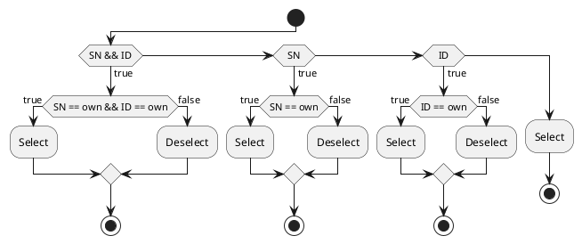

# MDU

[](https://github.com/ZIMO-Elektronik/MDU/actions/workflows/build.yml) [](https://github.com/ZIMO-Elektronik/MDU/actions/workflows/tests.yml)


MDU is an acronym for Multi Decoder Update, a protocol for firmware and ZPP updates over the rail. The protocol is currently supported in the form documented here by the following products:
- Command stations
  - MXULF
  - Z21
- Decoders
  - MS/MN decoders

## Table of Contents
- [Entry](#entry)
- [Alternative entry](#alternative-entry)
- [Transmission](#transmission)
- [Bit timings](#bit-timings)
- [Structure of a data packet](#structure-of-a-data-packet)
- [Commands](#commands)
- [Acknowledgment](#acknowledgment)
- [General commands](#general-commands)
- [Firmware commands](#firmware-commands)
- [ZPP commands](#zpp-commands)
- [Typical processes](#typical-processes)
- [Examples](#examples)
- [Configuration](#configuration)

## Entry
Activation of the MDU protocol is accomplished through a sequence of commands to **verify** configuration variables (CVs) in DCC operations mode. The entire sequence must be broadcast and thus sent to broadcast address 0. Details on the command structure can be found in [RCN-214](http://normen.railcommunity.de/RCN-214.pdf), especially point 2 ("Configuration variable access command - long form"). Depending on the type of update desired, firmware or ZPP, the following sequences are to be sent:

| Firmware      | ZPP           |
| ------------- | ------------- |
| CV8   == 0xFF | CV8   == 0xFE |
| CV105 == ID   | CV105 == 0xAA |
| CV106 == ID   | CV106 == 0x55 |
| CV105 == ID   | CV105 == 0x55 |
| CV106 == ID   | CV106 == 0xAA |
| CV105 == 0x00 | CV105 == 0x00 |
| CV106 == 0x00 | CV106 == 0x00 |

## Alternative entry
As an alternative to entry via DCC CV verify commands, a preamble with [default bit timings](#bit-timings) can be transmitted directly after switching on the rail voltage. The preamble should be sent for at least 200ms.

## Transmission
Bit transmission takes place MSB-first similar to the DCC protocol described in [RCN-210](http://normen.railcommunity.de/RCN-210.pdf) through zero crossings (change of polarity) of the rail signal. In contrast to DCC, the transmission of a bit does not require two, but only one zero crossing. The decision as to whether a received bit represents a zero bit, one bit or acknowledgment bit is determined by the time interval between the zero crossings. This time interval has a default value at the beginning, but can be varied using a separate command (see [Config-Transfer-Rate command](#config-transfer-rate)). In addition, there are so-called fallback timings that must be able to be received at any time.

At the end of a data packet, so-called acknowledgment bits are sent by the command station. **Selected decoders** (see [Ping command](#ping)) can respond within this time by means of current pulses (ack bits). This is comparable to the programming mode of the DCC protocol (service mode) described in [RCN-216](http://normen.railcommunity.de/RCN-216.pdf). The feedback phase is divided into two channels.

**Channel 1** (ackreq bits 2-4) is intended for transmission and checksum errors (CRC). Decoders that have not completely received a packet or whose CRC check failed can declare a packet invalid by sending ack bits. command stations must then repeat the last packet sent.

**Channel 2** (ackreq bits 6-8) is for data acknowledgment. The meaning depends on the last command transmitted. For an overview, refer to the table in the [acknowledgment](#acknowledgment) chapter. The detailed description of individual commands that follows later also goes into more detail about the meaning.

Command stations must send at least 10 acknowledgment bits. Decoders that want to give feedback in a channel must answer at least 2 of 3 ackreq bits within this channel with an ack bit. Even a single received ack bit is to be evaluated by the command station as a response. In order not to overload command stations with sensitive overcurrent shutdown, the ack bits can also be transmitted as PWM instead of continuous current pulses. For Roco's Z21, for example, 90% duty cycle with a period of 10µs turned out to be ideal.

## Bit timings
At the beginning of a transfer, all devices start with the default setting. The command station can now gradually increase the transmission speed. If one of the decoders on the rail responds with an ack bit to signal that the desired speed is not supported, the station must transmit a Config-Transfer-Rate command to revise the setting with fallback timings. This is the only way to ensure that the settings on the decoders do not diverge. The fallback timings (speed 0) are therefore always active and must always be able to be received regardless of the selected speed.

| Speed        | One bit [µs] | Zero bit [µs] | Ackreq bit [µs] | Ack bit [µs] | Decoder tolerance [%] |
| ------------ | ------------ | ------------- | --------------- | ------------ | --------------------- |
| 0 (fallback) | 1200         | 2400          | 3600            | 100          | 10                    |
| 1            | 10           | 20            | 60              | 40           | 30                    |
| 2            | 20           | 40            | 60              | 40           | 20                    |
| 3            | 40           | 80            | 120             | 80           | 20                    |
| 4 (default)  | 75           | 150           | 225             | 100          | 10                    |

## Structure of a data packet
The following flowchart describes the general structure of an MDU data packet.


In principle, each command packet contains the phases preamble, data and acknowledgement. The meaning of the transmitted data and the acknowledgment depends on the command package itself and will be itemized later for each command.

| Command phase              | Description                                                    |
| -------------------------- | -------------------------------------------------------------- |
| Preamble                   | Identification and synchronization of an MDU packet            |
| Data (coding)              | 4-byte identification of the command                           |
| Data (optional)            | Optional transmission of data depending on the command package |
| Data (CRC)                 | 1- or 4-byte checksum of the packet                            |
| Acknowledgement (optional) | Optional acknowledgement depending on command package          |

## Commands
The supported commands of the MDU protocol are divided into 3 categories: general, firmware and ZPP. Devices that only want to support either firmware or ZPP updates only have to support the command set actually used. However, the general command set must be implemented.

| General commands     | Coding      | Firmware commands          | Coding      | ZPP commands    | Coding      |
| -------------------- | ----------- | -------------------------- | ----------- | --------------- | ----------- |
|                      |             |                            |             | ZPP-Valid-Query | 0xFFFF'FF06 |
| Ping                 | 0xFFFF'FFFF | Firmware-Salsa20-IV        | 0xFFFF'FFF7 | ZPP-LC-DC-Query | 0xFFFF'FF07 |
| Config-Transfer-Rate | 0xFFFF'FFFE | Firmware-Erase             | 0xFFFF'FFF5 | ZPP-Erase       | 0xFFFF'FF05 |
| Binary-Search        | 0xFFFF'FFFA | Firmware-Update            | 0xFFFF'FFF8 | ZPP-Update      | 0xFFFF'FF08 |
| CV-Read              | 0xFFFF'FFF6 | Firmware-CRC32-Start       | 0xFFFF'FFFB | ZPP-Update-End  | 0xFFFF'FF0B |
| CV-Write             | 0xFFFF'FFF9 | Firmware-CRC32-Result      | 0xFFFF'FFFC | ZPP-Exit        | 0xFFFF'FF0C |
| Busy                 | 0xFFFF'FFF2 | Firmware-CRC32-Result&Exit | 0xFFFF'FFFD | ZPP-Exit&Reset  | 0xFFFF'FF0D |

## Acknowledgment
<table>
  <tr>
    <th style="text-align: center">Ackreq bit</th>
    <th style="text-align: center">0</th>
    <th style="text-align: center">1</th>
    <th style="text-align: center">2</th>
    <th style="text-align: center">3</th>
    <th style="text-align: center">4</th>
    <th style="text-align: center">5</th>
    <th style="text-align: center">6</th>
    <th style="text-align: center">7</th>
    <th style="text-align: center">8</th>
    <th style="text-align: center">9</th>
  </tr>
  <tr>
    <td>Ping</td>
    <td colspan=2 style="text-align: center">Reference</td>
    <td colspan=3 style="text-align: center">Incomplete package | CRC8 error | buffer full</td>
    <td></td>
    <td colspan=3 style="text-align: center">Ping successful</td>
    <td></td>
  </tr>
  <tr>
    <td>Config-Transfer-Rate</td>
    <td colspan=2 style="text-align: center">Reference</td>
    <td colspan=3 style="text-align: center">Incomplete package | CRC8 error | buffer full</td>
    <td></td>
    <td colspan=3 style="text-align: center">Bit timings are not supported</td>
    <td></td>
  </tr>
  <tr>
    <td>Binary-Search</td>
    <td colspan=2 style="text-align: center">Reference</td>
    <td colspan=3 style="text-align: center">Incomplete package | CRC8 error | buffer full</td>
    <td></td>
    <td colspan=3 style="text-align: center">See description</td>
    <td></td>
  </tr>
  <tr>
    <td>CV-Read</td>
    <td colspan=2 style="text-align: center">Reference</td>
    <td colspan=3 style="text-align: center">Incomplete package | CRC8 error | buffer full</td>
    <td></td>
    <td colspan=3 style="text-align: center">Bit in CV is set</td>
    <td></td>
  </tr>
  <tr>
    <td>CV-Write</td>
    <td colspan=2 style="text-align: center">Reference</td>
    <td colspan=3 style="text-align: center">Incomplete package | CRC8 error | buffer full</td>
    <td></td>
    <td colspan=3 style="text-align: center">Write not possible</td>
    <td></td>
  </tr>
  <tr>
    <td>Busy</td>
    <td colspan=2 style="text-align: center">Reference</td>
    <td colspan=3 style="text-align: center">Incomplete package | CRC8 error</td>
    <td></td>
    <td colspan=3 style="text-align: center">Decoder busy</td>
    <td></td>
  </tr>
  <tr>
    <td>Firmware-Salsa20-IV</td>
    <td colspan=2 style="text-align: center">Reference</td>
    <td colspan=3 style="text-align: center">Incomplete package | CRC8 error | buffer full</td>
    <td></td>
    <td colspan=3 style="text-align: center">CRC8 error</td>
    <td></td>
  </tr>
  <tr>
    <td>Firmware-Erase</td>
    <td colspan=2 style="text-align: center">Reference</td>
    <td colspan=3 style="text-align: center">Incomplete package | CRC8 error | buffer full</td>
    <td></td>
    <td colspan=3 style="text-align: center">Invalid memory area</td>
    <td></td>
  </tr>
  <tr>
    <td>Firmware-Update</td>
    <td colspan=2 style="text-align: center">Reference</td>
    <td colspan=3 style="text-align: center">Incomplete package | CRC32 error | buffer full</td>
    <td></td>
    <td colspan=3 style="text-align: center">Invalid address | CRC32 error</td>
    <td></td>
  </tr>
  <tr>
    <td>Firmware-CRC32-Start</td>
    <td colspan=2 style="text-align: center">Reference</td>
    <td colspan=3 style="text-align: center">Incomplete package | CRC8 error | buffer full</td>
    <td></td>
    <td colspan=3 style="text-align: center">Invalid memory area</td>
    <td></td>
  </tr>
  <tr>
    <td>Firmware-CRC32-Result</td>
    <td colspan=2 style="text-align: center">Reference</td>
    <td colspan=3 style="text-align: center">Incomplete package | CRC8 error | buffer full</td>
    <td></td>
    <td colspan=3 style="text-align: center">Received CRC32 not equal own</td>
    <td></td>
  </tr>
  <tr>
    <td>Firmware-CRC32-Result&Exit</td>
    <td colspan=2 style="text-align: center">Reference</td>
    <td colspan=3 style="text-align: center">Incomplete package | CRC8 error | buffer full</td>
    <td></td>
    <td colspan=3 style="text-align: center">Received CRC32 not equal own</td>
    <td></td>
  </tr>
  <tr>
    <td>ZPP-Valid-Query</td>
    <td colspan=2 style="text-align: center">Reference</td>
    <td colspan=3 style="text-align: center">Incomplete package | CRC8 error | buffer full</td>
    <td></td>
    <td colspan=3 style="text-align: center">ZPP invalid</td>
    <td></td>
  </tr>
  <tr>
    <td>ZPP-LC-DC-Query</td>
    <td colspan=2 style="text-align: center">Reference</td>
    <td colspan=3 style="text-align: center">Incomplete package | CRC8 error | buffer full</td>
    <td></td>
    <td colspan=3 style="text-align: center">Loadcode wrong</td>
    <td></td>
  </tr>
  <tr>
    <td>ZPP-Erase</td>
    <td colspan=2 style="text-align: center">Reference</td>
    <td colspan=3 style="text-align: center">Incomplete package | CRC8 error | buffer full</td>
    <td></td>
    <td colspan=3 style="text-align: center">Invalid memory area</td>
    <td></td>
  </tr>
  <tr>
    <td>ZPP-Update</td>
    <td colspan=2 style="text-align: center">Reference</td>
    <td colspan=3 style="text-align: center">Incomplete package | CRC32 error | buffer full</td>
    <td></td>
    <td colspan=3 style="text-align: center">Invalid address | CRC32 error</td>
    <td></td>
  </tr>
  <tr>
    <td>ZPP-Update-End</td>
    <td colspan=2 style="text-align: center">Reference</td>
    <td colspan=3 style="text-align: center">Incomplete package | CRC8 error | buffer full</td>
    <td></td>
    <td colspan=3 style="text-align: center">Invalid memory area</td>
    <td></td>
  </tr>
  <tr>
    <td>ZPP-Exit</td>
    <td colspan=2 style="text-align: center">Reference</td>
    <td colspan=3 style="text-align: center">Incomplete package | CRC8 error | buffer full</td>
    <td></td>
    <td colspan=3 style="text-align: center">-</td>
    <td></td>
  </tr>
  <tr>
    <td>ZPP-Exit&Reset</td>
    <td colspan=2 style="text-align: center">Reference</td>
    <td colspan=3 style="text-align: center">Incomplete package | CRC8 error | buffer full</td>
    <td></td>
    <td colspan=3 style="text-align: center">-</td>
    <td></td>
  </tr>
</table>

## General commands
The general command set contains commands for searching and selecting decoders, setting the bit timings, writing and reading configuration variables, and a busy query.

### Ping
| Command phase   | Description                        |
| --------------- | ---------------------------------- |
| Preamble        | Identification and synchronization |
| Data (coding)   | 0xFFFF'FFFF                        |
| Data            | 4-byte serial number               |
| Data            | 4-byte decoder ID (MSB first)      |
| Data (CRC)      | 1-byte CRC8                        |
| Acknowledgement | Ping successful                    |

A ping command allows individual decoders or decoder types to be selected. Only **selected decoders** may execute commands and send acknowledgements to the command station. In the initial state after a reset, all decoders are selected. The selection is made by transmitting a 4-byte serial number and a 4-byte decoder ID. A decoder is considered to be selected if all received numbers that are not 0 match those of the decoder. If only 0 is transmitted, all decoders are selected. This results in the following variants:
- If a serial number and a decoder ID are transmitted, a single decoder with the corresponding serial number and ID is selected.
- If a serial number and decoder ID 0 is transmitted, all decoders with the corresponding serial number are selected.
- If serial number 0 and a decoder ID is transmitted, all decoders with the corresponding ID are selected.
- If serial number 0 and decoder ID 0 is transmitted, all decoders are selected.



### Config-Transfer-Rate
| Command phase   | Description                                   |
| --------------- | --------------------------------------------- |
| Preamble        | Identification and synchronization            |
| Data (coding)   | 0xFFFF'FFFE                                   |
| Data            | 1-byte index into [bit timings](#bit-timings) |
| Data (CRC)      | 1-byte CRC8                                   |
| Acknowledgement | Bit timings are not supported                 |

With the help of a Config-Transfer-Rate command, the transmission speed can be adapted to the decoder by setting the bit timings. The exact times for one bit, zero bit, ackreq bit and ack bit can be found in the [bit timings](#bit-timings). If a decoder does not support the selected transmission speed, an acknowledgement must be sent in channel 2.

### Binary-Search
| Command phase   | Description                        |
| --------------- | ---------------------------------- |
| Preamble        | Identification and synchronization |
| Data (coding)   | 0xFFFF'FFFA                        |
| Data            | 1-byte see description             |
| Data (CRC)      | 1-byte CRC8                        |
| Acknowledgement | See description                    |

The Binary-Search command is used to search for decoders that support MDU. The following combination of serial number and decoder ID is used for clear identification:
```c
uint64_t bin_search_number = (decoder_id << 32u) | serial_number;
```
With the exception of the MSB (always 0), that number can be queried bit by bit. Again, reference is made to [RCN-214](http://normen.railcommunity.de/RCN-214.pdf), which provides a similar command for the programming mode of the DCC protocol to read CVs bit by bit.

Since, in contrast to DCC, several decoders can send an acknowledgment at the same time, further commands are required in addition to querying a bit, which are represented with the help of special values or closed intervals.
- 255  
  Special value that initiates the start or restart of the binary search. All decoders that have received this packet reply with an acknowledgment. All decoders that have not received this packet are excluded from further search history and also send **no** acknowledgment.

- [0...62]  
  The data byte received corresponds to the bit number of the bit to be checked. All decoders with this bit set respond.

- [64...64+62]  
  The received data byte-64 corresponds to the bit number of the inverted bit to be checked. All decoders with this bit cleared respond.

- [128...128+62]  
  The received data byte-128 corresponds to the bit number of the bit to be checked. All decoders with this bit set end the binary search. Only special value 255 can restart the binary search at this point.

- [192...192+62]  
  The received data byte-192 corresponds to the bit number of the inverted bit to be checked. All decoders with this bit cleared end the binary search. Only special value 255 can restart the binary search at this point.

The following flowchart shows the binary search process from the perspective of the decoder.


// TODO Flowchart for command station?

### CV-Read
| Command phase   | Description                        |
| --------------- | ---------------------------------- |
| Preamble        | Identification and synchronization |
| Data (coding)   | 0xFFFF'FFF6                        |
| Data            | 2-byte CV number (MSB first)       |
| Data            | 1-byte bit number (0...7)          |
| Data (CRC)      | 1-byte CRC8                        |
| Acknowledgement | Bit in CV is set                   |

CV-Read reads a single bit of the configuration variable with the received number. If the bit is set, an acknowledgement is sent in channel 2.

### CV-Write
| Command phase   | Description                        |
| --------------- | ---------------------------------- |
| Preamble        | Identification and synchronization |
| Data (coding)   | 0xFFFF'FFF9                        |
| Data            | 2-byte CV number (MSB first)       |
| Data            | 1-byte CV value                    |
| Data (CRC)      | 1-byte CRC8                        |
| Acknowledgement | Write not possible                 |

CV-Write writes a configuration variable with the received number-value pair. Any write errors must be answered with an acknowledgement in channel 2.

### Busy
| Command phase   | Description                        |
| --------------- | ---------------------------------- |
| Preamble        | Identification and synchronization |
| Data (coding)   | 0xFFFF'FFF2                        |
| Data (CRC)      | 1-byte CRC8                        |
| Acknowledgement | Decoder busy                       |

The Busy command can be used to check whether the decoder is still busy with the last packet. If a decoder is not yet ready for a new packet, it can reply with an acknowledgment in channel 2. If the command station sends packets other than Busy to decoders that are still busy, the packets are discarded and acknowlegded with a response in channel 1.

## Firmware commands
The firmware command set is used to update the decoder software. Among other things, it contains an update command, commands for a final CRC32 check and a command for transmitting the initialization vector of the [Salsa20](https://en.wikipedia.org/wiki/Salsa20) encryption used.

### Firmware-Salsa20-IV
| Command phase   | Description                          |
| --------------- | ------------------------------------ |
| Preamble        | Identification and synchronization   |
| Data (coding)   | 0xFFFF'FFF7                          |
| Data            | 8-byte Salsa20 initialization vector |
| Data (CRC)      | 1-byte CRC8                          |
| Acknowledgement | CRC8 error                           |

Firmware-Salsa20-IV is used to transmit the 8-byte initialization vector of the Salsa20 encryption. For reasons of backward compatibility, CRC8 errors must be answered in both channel 1 and channel 2.

### Firmware-Erase
| Command phase   | Description                        |
| --------------- | ---------------------------------- |
| Preamble        | Identification and synchronization |
| Data (coding)   | 0xFFFF'FFF5                        |
| Data            | 4-byte start address               |
| Data            | 4-byte end address                 |
| Data (CRC)      | 1-byte CRC8                        |
| Acknowledgement | Invalid memory area                |

The processor flash is deleted before an update package is written. If an invalid memory area is received, an acknowledgment must be given in channel 2. **After the command, a delay of at least 3.5s must be observed.**

### Firmware-Update
| Command phase   | Description                        |
| --------------- | ---------------------------------- |
| Preamble        | Identification and synchronization |
| Data (coding)   | 0xFFFF'FFF8                        |
| Data            | 4-byte start address               |
| Data            | N-byte payload                     |
| Data (CRC)      | 4-byte CRC32                       |
| Acknowledgement | Invalid address or CRC32 error     |

Firmware-Update is used to transfer firmware data. If an invalid address or a CRC32 error is received, there must be an acknowledgment in channel 2.

### Firmware-CRC32-Start
| Command phase   | Description                        |
| --------------- | ---------------------------------- |
| Preamble        | Identification and synchronization |
| Data (coding)   | 0xFFFF'FFFB                        |
| Data            | 4-byte start address               |
| Data            | 4-byte end address                 |
| Data (CRC)      | 4-byte CRC32                       |
| Acknowledgement | Invalid memory area                |

Firmware-CRC32-Start transfers the written memory area and the CRC32 of the encrypted firmware again at the end of the update. **It should be noted that the checksum to be compared must be calculated using the encrypted data!** If the transferred memory area does not match the one received via firmware update packets, then a response must be made in channel 2. **Caution, the transferred memory area is a closed interval. The last address actually written corresponds to the end address!**

### Firmware-CRC32-Result
| Command phase   | Description                        |
| --------------- | ---------------------------------- |
| Preamble        | Identification and synchronization |
| Data (coding)   | 0xFFFF'FFFC                        |
| Data (CRC)      | 1-byte CRC8                        |
| Acknowledgement | Received CRC32 not equal own       |

With the help of the Firmware-CRC32-Result command, the command station queries the result of the checksum previously transmitted via Firmware-CRC32-Start. If the checksum is not correct, there must be an acknowledgment in channel 2.

### Firmware-CRC32-Result&Exit
| Command phase   | Description                        |
| --------------- | ---------------------------------- |
| Preamble        | Identification and synchronization |
| Data (coding)   | 0xFFFF'FFFD                        |
| Data (CRC)      | 1-byte CRC8                        |
| Acknowledgement | Received CRC32 not equal own       |

See Firmware-CRC32-Result. If the checksum is correct, the decoder must perform a reset.

## ZPP commands
The ZPP command set is used to update the ZPP project. It contains, among other things, an erase and update command, commands for ending the transfer and an exit command.

### ZPP-Valid-Query
| Command phase   | Description                        |
| --------------- | ---------------------------------- |
| Preamble        | Identification and synchronization |
| Data (coding)   | 0xFFFF'FF06                        |
| Data            | 2-byte ZPP identifier              |
| Data            | 4-byte flash size                  |
| Data (CRC)      | 1-byte CRC8                        |
| Acknowledgement | ZPP invalid                        |

A ZPP-Valid-Query can be used to check whether the decoders are able to load the desired ZPP at all. The check includes the 2-character identifier of the ZPP file and the size of its flash data. If the ZPP cannot be loaded, an acknowledgment must be sent in channel 2.

### ZPP-LC-DC-Query
| Command phase   | Description                        |
| --------------- | ---------------------------------- |
| Preamble        | Identification and synchronization |
| Data (coding)   | 0xFFFF'FF07                        |
| Data            | 4-byte developer code              |
| Data (CRC)      | 1-byte CRC8                        |
| Acknowledgement | Loadcode wrong                     |

A ZPP-LC-DC query can be used to check whether the decoders contain a valid loadcode before deleting the flash. If the received loadcode is not correct, an acknowledgment must be sent in channel 2.

### ZPP-Erase
| Command phase   | Description                        |
| --------------- | ---------------------------------- |
| Preamble        | Identification and synchronization |
| Data (coding)   | 0xFFFF'FF05                        |
| Data            | 4-byte start address               |
| Data            | 4-byte end address                 |
| Data (CRC)      | 1-byte CRC8                        |
| Acknowledgement | Invalid memory area                |

With the help of ZPP-Erase, a certain memory area of the flash can be deleted. If an invalid memory area is received, an acknowledgment must be given in channel 2. **After the command, a delay of at least 3.5s must be observed.**

### ZPP-Update
| Command phase   | Description                                 |
| --------------- | ------------------------------------------- |
| Preamble        | Identification and synchronization          |
| Data (coding)   | 0xFFFF'FF08                                 |
| Data            | 4-byte start address                        |
| Data            | N-byte payload                              |
| Data (CRC)      | 4-byte CRC32                                |
| Acknowledgement | Invalid address or CRC32 error              |

ZPP-Update is used to transfer ZPP data. If an invalid memory area or a CRC32 error is received, there must be an acknowledgment in channel 2.

### ZPP-Update-End
| Command phase   | Description                        |
| --------------- | ---------------------------------- |
| Preamble        | Identification and synchronization |
| Data (coding)   | 0xFFFF'FF0B                        |
| Data            | 4-byte start address               |
| Data            | 4-byte end address                 |
| Data (CRC)      | 1-byte CRC8                        |
| Acknowledgement | Invalid memory area                |

ZPP-Update-End marks the end of the current data transmission and retransmits the written memory area. Any ZPP data that is still buffered must be written when this command is received. If an invalid memory area is received, an acknowledgment must be given in channel 2.

### ZPP-Exit
| Command phase   | Description                        |
| --------------- | ---------------------------------- |
| Preamble        | Identification and synchronization |
| Data (coding)   | 0xFFFF'FF0C                        |
| Data (CRC)      | 1-byte CRC8                        |
| Acknowledgement | -                                  |

ZPP-Exit is used to reset the decoder. The reset is only carried out if the memory area previously transferred via the ZPP-Update-End matches that written by the decoder. If this is not the case, the decoder discards all written data.

### ZPP-Exit&Reset
| Command phase   | Description                        |
| --------------- | ---------------------------------- |
| Preamble        | Identification and synchronization |
| Data (coding)   | 0xFFFF'FF0D                        |
| Data (CRC)      | 1-byte CRC8                        |
| Acknowledgement | -                                  |

See ZPP-Exit. In addition, decoders reset their configuration variables (CV8=8).

## Typical processes
### Firmware update
1. Ping all decoders
2. Find a Config-TransferRate that is supported by all decoders
3. Ping select the desired decoders
4. Firmware-Erase
5. Firmware-Update
6. Firmware-CRC32-Start
7. Firmware-CRC32-Result | Firmware-CRC32-Result&Exit
8. Maintain voltage for at least 500ms

### ZPP update
1.  Ping all decoders
2.  Find a Config-Transfer-Rate that is supported by all decoders
3.  Ping select the desired decoders
4.  ZPP-Valid-Query
    -ZPP-Exit on answer
5.  ZPP-LC-DC-Query (optional)
    - ZPP-Exit on answer
6.  ZPP-Erase
7.  ZPP-Update
8.  ZPP-Update-End
9.  ZPP-Exit | ZPP-Exit&Reset
10. Maintain voltage for at least 500ms

## Examples
To use the MDU library, a number of virtual functions must be implemented. Depending on whether firmware or ZPP is to be transferred, one of the following abstract classes must be derived:
- mdu::rx::FirmwareBase
- mdu::rx::ZppBase
- mdu::rx::FirmwareZppBase

The following example shows the skeleton code for implementing the ZPP update.
```cpp
#include <mdu/mdu.hpp>

class ZppLoad : public mdu::rx::ZppBase {
public:
  // Ctor takes configuration struct containing serial number, decoder ID and
  // supported tranfer rate
  ZppLoad()
    : mdu::rx::ZppBase{{.serial_number = SERIAL_NUMBER,
                        .decoder_id = ID,
                        .transfer_rate = mdu::TransferRate::Fast}} {}

private:
  // Generate current pulse of length "us" in µs
  void ackbit(uint32_t us) const final {}

  // Read CV bit
  bool readCv(uint32_t addr, uint32_t position) const final {}

  // Write CV
  bool writeCv(uint32_t addr, uint8_t value) final {}

  // Check if ZPP is valid
  bool zppValid(std::string_view zpp_id, size_t zpp_flash_size) const final {}

  // Check if loadcode is valid
  bool loadcodeValid(std::span<uint8_t const, 4uz> developer_code) const final {}

  // Erase ZPP in the closed-interval [begin_addr, end_addr[
  bool eraseZpp(uint32_t begin_addr, uint32_t end_addr) final {}

  // Write ZPP
  bool writeZpp(uint32_t addr, std::span<uint8_t const> chunk) final {}

  // Update done
  bool endZpp() final {}

  // Exit (eventually perform CV reset)
  [[noreturn]] void exitZpp(bool reset_cvs) final {}

  // Timer interrupt calls receive with captured value
  void interrupt() { receive(TIMER_VALUE); }
};
```

The entry into the MDU protocol can be handled by the `receive::entry::Point` class. The ctor takes the decoder ID and two optional function objects hooks to call before starting the firmware or ZPP update.
```cpp
// Ctor takes ID und function object hooks with void() signature
mdu::rx::entry::Point entry_point{{.decoder_id = ID,
                                   .firmware_entry = enter_firmware_update,
                                   .zpp_entry = nullptr}};                                       

// Forward DCC verifies
entry_point.verify(index, value);
```

## Configuration
- MDU_UNITY_BUILD  
  Enable unity build

- MDU_RX_PREAMBLE_BITS  
  Number of preambel bits of decoder

- MDU_RX_ACKREQ_BITS  
  Number of ackreq bits of decoder

- MDU_TX_PREAMBLE_BITS  
  Number of preambel bits of command station

- MDU_TX_ACKREQ_BITS  
  Number of ackreq bits of command station

- MDU_TESTS_MASTER_KEY  
  Pass master key for ZSU decryption to tests